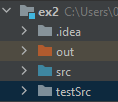
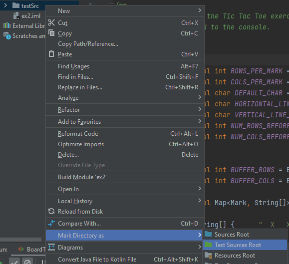
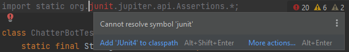
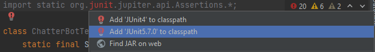

# OOP Ex4 Tests
featured in Exercise 4 of the new "Introduction to OOP" course,
HUJI, Winter 2021-2022 Semester. \
Written by Erel Debel.

========================================================================================

The tests are based on the ASCII art produced by my solution.
If you think there might be a problem with the tests or the compared files, feel free to use the _Issues_ section of this GitHub repo.

<B>The tests can be configured and run by:</B>
1. Put the test directory, _testSrc_, in your project directory (in the same directory as "src" and "out"):

    
	
2. Open the project in _IntelliJ_ if you haven't yet. 

3. Right-click the _testSrc_ directory and choose  
  _Mark Directory as -> Test Sources Root_:
  
	
  
4. Open the file _BoardTest.java_ inside the _testSrc_ directory.

5. On the first line' hover mouse over the red text and press _Alt+Enter_:
 
	

6. Then choose _JUnit 5_:
  
	
  
7. Right-click _testSrc_ directory or press _Ctrl+Shift+F10_ to run all tests:

	

Good luck!\
Erel
